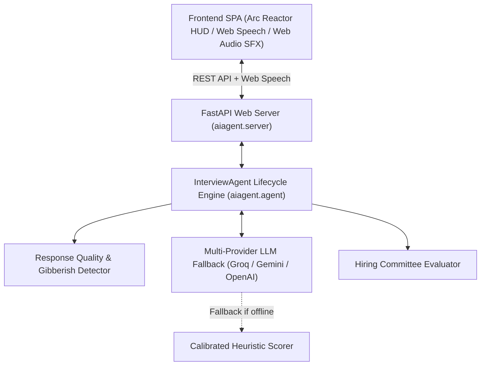

# ⚡ J.A.R.V.I.S. — Autonomous Career Intelligence & Assessment Engine

**J.A.R.V.I.S.** (*Just A Rather Very Intelligent System*) is a full-stack, autonomous **AI Technical Assessor and Career Coach** built with **LangChain**, **FastAPI**, and modern **Web Speech & Audio APIs**. Designed with a high-tech Stark Industries HUD aesthetic, J.A.R.V.I.S. conducts realistic, adaptive technical interviews with real-time speech synthesis, live microphone transcription, dynamic architectural probing, and strictly calibrated Bar-Raiser evaluation scorecards.

---

## 🌟 Key Features

- **🎯 Calibrated Accuracy & Anti-Hallucination Grading Engine**:
  - **Evidence-Based Scoring**: Evaluates only the technical substance actually demonstrated.
  - **Zero Tolerance for Fluff**: Evasive answers, random text, or gibberish ("idk", "asdf", buzzword stuffing) are penalized with 0–15/100 and an immediate "No Hire" verdict.
  - **Calibrated Heuristic Fallback**: Deterministic analysis ensures fair and rigorous scoring even if offline or during network timeouts—preventing arbitrary high scores.
- **🎙️ Real-Time Voice Cognition & Audio HUD**:
  - **Holographic Arc Reactor HUD**: Animated multi-ring Arc Reactor avatar with concentric rotating rings and real-time frequency-reactive wave displays.
  - **Speech-to-Text (STT)**: Voice transcription streaming directly into the candidate answer dock.
  - **Text-to-Speech (TTS)**: Crisp J.A.R.V.I.S. voice synthesis reciting questions aloud.
  - **Web Audio SFX Synthesizer**: High-tech cyber telemetry chimes, activation sweeps, and digital feedback.
- **🧠 Multi-Provider LLM Engine with Instant Failover**:
  - Primary: **Groq** (`qwen/qwen3.8-27b`, `openai/gpt-oss-120b`) for ultra-low latency conversational streaming.
  - Fallback 1: **Google Gemini** (`gemini-2.5-flash`).
  - Fallback 2: **OpenAI** (`gpt-4o-mini`).
  - Fallback 3: **J.A.R.V.I.S. Heuristic Engine** for deterministic local assessment.
- **🎭 High-Tech Assessment Protocols (Personas)**:
  - **J.A.R.V.I.S. Protocol**: Ultra-intelligent, polite yet exacting, deeply analytical, strictly verifies technical accuracy and trade-offs.
  - **FAANG Bar Raiser**: Formal, probing edge cases, scalability limits, and optimal complexity.
  - **Staff Architect Protocol**: Focuses on clean architecture, boundary isolation, maintainability, and clear communication.
  - **Startup CTO Protocol**: Pragmatic, fast-paced, testing real-world incident recovery and execution velocity.
- **🎯 Tailored Career Tracks & Difficulty**:
  - Full-Stack Engineer, Backend Systems, Frontend Architect, AI/ML & LLM Engineer, Data Science, DevOps/Cloud, Product Manager, and Behavioral (STAR).
  - Seniority levels: *Junior (0-2 YOE)*, *Mid-Level (2-5 YOE)*, *Senior (5-8 YOE)*, *Lead / Staff Architect (8+ YOE)*.
- **💡 Real-Time Assistance & Architectural Depth Telemetry**:
  - Smart **"Request Tactical Hint"** button to guide candidates without giving away solutions.
  - Live **Depth Telemetry Counter** indicating response word count and warning against shallow submissions.
- **📊 Executive Assessment Dossier & Scorecard**:
  - **Overall Score (0-100)** and Calibrated Verdict Badge (*Strong Hire*, *Hire*, *Leaning Hire*, *Leaning No Hire*, *No Hire*).
  - **4-Axis Pillar Skills**: Technical Competence, Problem Solving & Logic, Communication & Precision, Systematic Architecture.
  - **Validated Strengths & Critical Growth Areas**: Actionable feedback bullets.
  - **Round-by-Round Breakdown**: Candidate response summaries, individual scores, critique, and ideal architectural benchmark outlines.
  - **Export Options**: Download Dossier as JSON or Print/Save to PDF.

---

## 🏗️ Architecture



---

## 🚀 Quickstart (Local Development)

### 1. Prerequisites
- Python `>= 3.10`
- Virtual environment or `uv` / `pip`

### 2. Environment Variables
Verify your `.env` file in the project root:
```env
# At least one key is required for live AI responses (Groq is recommended for ultra-fast speed)
GROQ_API_KEY=gsk_your_groq_api_key_here
GOOGLE_API_KEY=your_google_gemini_api_key_here
OPENAI_API_KEY=sk-your_openai_key_here
```

### 3. Run the Application

Using the existing virtual environment:
```bash
./.venv/bin/uvicorn aiagent.server:app --host 0.0.0.0 --port 8000 --reload
```

Or using standard Python:
```bash
pip install -r requirements.txt
python -m aiagent
```

### 4. Open in Browser
Visit **[http://localhost:8000](http://localhost:8000)** to engage J.A.R.V.I.S.!

---

## ☁️ Deployment Guide (Vercel & Cloud)

The repository comes pre-configured with `vercel.json` and `api/index.py` for immediate deployment.

### Option A: Deploy to Vercel via GitHub (Recommended)

1. **Commit and push your code to GitHub**:
   ```bash
   git add .
   git commit -m "feat: J.A.R.V.I.S. high-tech HUD & calibrated accuracy engine"
   git push origin main
   ```
2. **Import into Vercel**:
   - Go to [vercel.com/new](https://vercel.com/new) and select your GitHub repository.
   - Framework Preset: Select **Other** (Vercel automatically detects `vercel.json` and `@vercel/python`).
3. **Configure Environment Variables**:
   In the Vercel project settings under **Environment Variables**, add:
   - `GROQ_API_KEY`: Your Groq API key
   - `GOOGLE_API_KEY`: Your Google Gemini API key
   - `OPENAI_API_KEY`: Your OpenAI API key
4. **Deploy**:
   Vercel will build the serverless functions and provide your live production URL (e.g., `https://aiagent-liart.vercel.app`).

### Option B: Deploy via Vercel CLI

```bash
# Log in and deploy
vercel --prod
```

---

## 📂 Project Structure

```
aiagent/
├── .env                           # API keys (local only, gitignored)
├── .gitignore                     # Ignores .venv, .env, .vercel, caches
├── pyproject.toml                 # Project dependencies & scripts
├── requirements.txt               # Production requirements for Vercel/Pip
├── vercel.json                    # Vercel serverless routing configuration
├── api/
│   └── index.py                   # Vercel serverless entrypoint
├── README.md                      # Project documentation
├── src/
│   └── aiagent/
│       ├── __init__.py            # CLI entrypoint
│       ├── agent.py               # J.A.R.V.I.S. Core Engine, Accuracy Rubric & Calibrated Scorer
│       ├── server.py              # FastAPI REST endpoints & Resilient Session Hydration
│       └── static/
│           ├── index.html         # High-Tech Arc Reactor HUD Interface
│           ├── styles.css         # Cyber Obsidian & Stark Arc Reactor Design System
│           └── app.js             # Web Speech, Audio SFX, Visualizer & Calibrated Controller
└── updatedaiagent/
    └── 1-aiagent.ipynb            # Interactive step-by-step Jupyter Notebook tutorial
```

---

## 📡 REST API Reference

| Endpoint | Method | Description |
| :--- | :--- | :--- |
| `/api/health` | `GET` | Health check & active LLM provider telemetry |
| `/api/roles` | `GET` | Available career tracks |
| `/api/personas` | `GET` | Available J.A.R.V.I.S. assessment protocols |
| `/api/interview/start` | `POST` | Initialize an assessment session & receive Round 1 |
| `/api/interview/respond` | `POST` | Submit candidate answer, receive feedback & next diagnostic question |
| `/api/interview/hint` | `POST` | Request an architectural tactical hint |
| `/api/interview/finish` | `POST` | Complete interview & generate comprehensive evaluation dossier |
| `/api/interview/session/{id}` | `GET` | Retrieve full interview transcript & telemetry |

---

## 🧪 Interactive Jupyter Notebook Tutorial

To explore the LangChain agent logic step-by-step:
1. Open [`updatedaiagent/1-aiagent.ipynb`](file:///Users/adityasharma/aiagent/updatedaiagent/1-aiagent.ipynb)
2. Select the **`Python (aiagent)`** kernel
3. Run the cells to interact with the LLM chains directly from Python.
