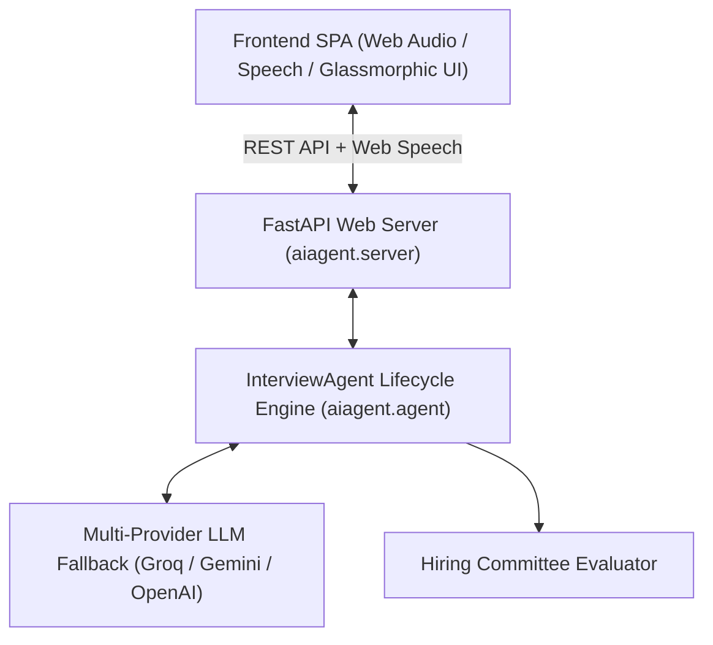

# ⚡ Aegis AI — Autonomous Job Interviewer Agent & Career Coach

An intelligent, full-stack **AI Job Interviewer Agent** built with **LangChain**, **FastAPI**, and modern **Web Speech & Audio APIs**. Aegis conducts realistic, adaptive technical and behavioral interviews with real-time speech synthesis, live microphone transcription, dynamic follow-ups, and instant Hiring Committee evaluation scorecards.

---

## 🌟 Key Features

- **🎙️ Real-Time Voice & Audio Interaction**:
  - **Speech-to-Text**: Voice transcription directly into the candidate answer dock.
  - **Text-to-Speech**: Realistic AI voice synthesis reading questions aloud.
  - **Live Frequency Waveform**: Web Audio API canvas visualizer displaying audio waves while speaking.
- **🧠 Multi-Provider LLM Engine with Automatic Failover**:
  - Primary: **Groq** (`qwen/qwen3.8-27b`, `openai/gpt-oss-120b`) for ultra-low latency conversational streaming.
  - Fallback 1: **Google Gemini** (`gemini-2.5-flash`).
  - Fallback 2: **OpenAI** (`gpt-4o-mini`).
  - Fallback 3: **Smart Offline Engine** so the interview never crashes if offline.
- **🎭 Customizable Interviewer Personas**:
  - **FAANG Bar Raiser**: Rigorous, probing edge cases, scalability, and optimal complexity.
  - **Friendly Mentor**: Warm, encouraging, offering positive reinforcement and guidance.
  - **Startup CTO**: Pragmatic, fast-paced, focusing on shipping fast and real-world trade-offs.
  - **Pragmatic Tech Lead**: Balanced between code craftsmanship, maintainability, and team velocity.
- **🎯 Tailored Career Tracks & Difficulty**:
  - Full-Stack Engineer, Backend Systems, Frontend Architect, AI/ML & LLM Engineer, Data Science, DevOps/Cloud, Product Manager, and Behavioral (STAR).
  - Seniority levels: *Junior (0-2 YOE)*, *Mid-Level (2-5 YOE)*, *Senior (5-8 YOE)*, *Lead / Staff Architect (8+ YOE)*.
- **💡 Real-Time Assistance & Adaptive Probing**:
  - Smart **"Request Hint"** button to guide candidates without giving away solutions.
  - Contextual reactions and dynamic follow-up questions based on the candidate's previous responses.
- **📊 Executive Evaluation Scorecard**:
  - **Overall Score (0-100)** and Hiring Recommendation Badge (*Strong Hire*, *Hire*, *Leaning Hire*, *No Hire*).
  - **4-Axis Pillar Skills**: Technical Competence, Problem Solving & Logic, Communication & Clarity, Systematic Thinking.
  - **Strengths & Growth Areas**: Actionable feedback bullets.
  - **Question-by-Question Deep Dive**: Candidate response summaries, individual scores, feedback, and ideal model answer outlines.
  - **Export Options**: Download Report as JSON or Print/Save to PDF.

---

## 🏗️ Architecture



---

## 🚀 Quickstart (Local Development)

### 1. Prerequisites
- Python `>= 3.13`
- [`uv`](https://github.com/astral-sh/uv) (recommended) or `pip`

### 2. Environment Variables
Create or verify your `.env` file in the project root:
```env
# At least one key is required for live AI responses (Groq is recommended for ultra-fast speed)
GROQ_API_KEY=gsk_your_groq_api_key_here
GOOGLE_API_KEY=your_google_gemini_api_key_here
OPENAI_API_KEY=sk-your_openai_key_here
```

### 3. Run the Application (Single Command)

Using `uv`:
```bash
uv run aiagent
```
*Alternatively, using uvicorn directly:*
```bash
uv run uvicorn aiagent.server:app --host 0.0.0.0 --port 8000 --reload
```

Using standard `pip` and Python:
```bash
pip install -r requirements.txt
python -m aiagent
```

### 4. Open in Browser
Visit **[http://localhost:8000](http://localhost:8000)** to start your interview!

---

## ☁️ Deployment Guide (Vercel & Cloud)

The repository comes pre-configured with `vercel.json` and `api/index.py` for immediate deployment.

### Option A: Deploy to Vercel via GitHub (Recommended)

1. **Push your code to GitHub**:
   ```bash
   git add .
   git commit -m "Deploy AI Interviewer to Vercel"
   git branch -M main
   git push -u origin main
   ```
2. **Import into Vercel**:
   - Go to [vercel.com/new](https://vercel.com/new) and select your GitHub repository.
   - Framework Preset: Select **Other** (Vercel will automatically detect `vercel.json` and `@vercel/python`).
3. **Configure Environment Variables**:
   In the Vercel project settings under **Environment Variables**, add:
   - `GROQ_API_KEY`: Your Groq API key
   - `GOOGLE_API_KEY`: Your Google Gemini API key
   - `OPENAI_API_KEY`: Your OpenAI API key
4. **Click Deploy**:
   Vercel will build the serverless functions and provide your live production URL (e.g., `https://your-aiagent.vercel.app`).

### Option B: Deploy via Vercel CLI

```bash
# Install Vercel CLI if not already installed
npm install -g vercel

# Log in and deploy
vercel
```
When prompted during CLI deployment:
- Link to existing project? `N`
- Project name: `aegis-aiagent`
- In which directory is your code located? `./`
- Set your environment variables when prompted or in the Vercel web dashboard.

---

## 📂 Project Structure

```
aiagent/
├── .env                           # API keys (local only, gitignored)
├── .gitignore                     # Ignores .venv, .env, and caches
├── pyproject.toml                 # Project dependencies & scripts
├── requirements.txt               # Production requirements for Vercel/Pip
├── vercel.json                    # Vercel serverless routing configuration
├── api/
│   └── index.py                   # Vercel serverless entrypoint
├── README.md                      # Project documentation
├── src/
│   └── aiagent/
│       ├── __init__.py            # CLI entrypoint (uv run aiagent)
│       ├── agent.py               # Core LangChain Interview Engine & Prompts
│       ├── server.py              # FastAPI REST endpoints & SPA server
│       └── static/
│           ├── index.html         # Single-Page Application interface
│           ├── styles.css         # Glassmorphism dark cyberpunk design
│           └── app.js             # Web Speech, Audio Visualizer, & state controller
└── updatedaiagent/
    └── 1-aiagent.ipynb            # Interactive step-by-step Jupyter Notebook tutorial
```

---

## 📡 REST API Reference

| Endpoint | Method | Description |
| :--- | :--- | :--- |
| `/api/health` | `GET` | Health check & active LLM provider status |
| `/api/roles` | `GET` | Available preset career tracks |
| `/api/personas` | `GET` | Available interviewer personas |
| `/api/interview/start` | `POST` | Initialize a session & receive Question 1 |
| `/api/interview/respond` | `POST` | Submit candidate answer & receive next question/follow-up |
| `/api/interview/hint` | `POST` | Request a guiding hint for the active question |
| `/api/interview/finish` | `POST` | Complete interview & generate comprehensive evaluation scorecard |
| `/api/interview/session/{id}` | `GET` | Retrieve full interview transcript & history |

---

## 🧪 Interactive Jupyter Notebook Tutorial

To explore the LangChain agent logic step-by-step:
1. Open [`updatedaiagent/1-aiagent.ipynb`](file:///Users/adityasharma/aiagent/updatedaiagent/1-aiagent.ipynb)
2. Select the **`Python (aiagent)`** kernel
3. Run the cells to interact with the LLM chains directly from Python.
